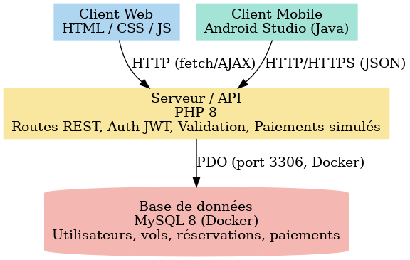

# Rapport de projet

## 1) Liste des membres de l’équipe

- **Mouhcine Imaoun** — GitHub : `Mouhcine212`, Discord : `Mou`
- **Andrea Borges** — GitHub : `Cvgirl`, Discord : `Gros_Chef_Bandit`
- **Bogdan Alexandru** — GitHub : `bogdan-b-alexandru`, Discord : `Buggy`
- **Bijoy Dey** — GitHub : `Bijoydey12345`, Discord : `Double Happiness`
- **Jonathan St-Louis** — GitHub : `JonathanStLouis`, Discord : `Jojo`

## Objectif principal de l’application

L’objectif principal de notre application **FlightETS** est de permettre aux utilisateurs de gérer entièrement leur expérience de voyage en ligne. Chaque client peut créer son propre compte personnel et le modifier à tout moment pour mettre à jour ses informations. Une fois connecté, il peut rechercher un vol en choisissant son aéroport de départ, sa destination et la date souhaitée. Après avoir sélectionné le vol qui lui convient, il peut procéder à la réservation et est automatiquement dirigé vers la page de paiement. Une fois le paiement effectué, la réservation est ajoutée à l’historique, permettant ainsi de consulter facilement les voyages prévus ou passés. L’application offre également la possibilité d’annuler une réservation à tout moment, garantissant ainsi une flexibilité totale pour l’utilisateur.

### Depuis le rapport d'analyse, les objectifs ont évolué :

- Abandon de **Vue.js** et **Laravel** : utilisation d’un frontend **HTML/CSS/JavaScript pur** et d’un backend **PHP** plus simple.
- Intégration d’un **système de paiement simulé** avec génération automatique de siège.
- Ajout d’une page **Historique** pour voir les réservations passées.
- Mise en place d’un **JWT maison** pour l’authentification.

### 3. Comparaison des technologies prévues vs utilisées

| **Composant**         | **Technologies prévues (analyse)**     | **Technologies utilisées (final)** | **Modifications**                          |
|-----------------------|----------------------------------------|--------------------------------------|---------------------------------------------|
| Frontend              | Vue.js 3 + Bootstrap 5 + Axios         | HTML, CSS, JavaScript pur            | Changement complet du framework             |
| Backend               | Laravel (PHP) + Sanctum                | PHP procédural avec JWT              | Simplification                              |
| Base de données       | MySQL                                  | MySQL (Docker)                       | Ajout Docker                                |
| Authentification      | Laravel Sanctum JWT                    | JWT personnalisé en PHP              | Remplacement                                |
| Hébergement           | XAMPP                                  | Docker (PHP + MySQL)                 | Uniformisation dev                          |

### 4. Diagramme d’architecture (3 tier architecture)

## Diagramme d’architecture

#### [ Client Web ]
HTML / CSS / JS  
&nbsp;&nbsp;&nbsp;⬇ **HTTP** (fetch/AJAX)  
&nbsp;&nbsp;&nbsp;⬇  
**[ Serveur d'app ]**  
PHP 8 — Routes REST, Auth JWT, Validation, Paiements simulés  
&nbsp;&nbsp;&nbsp;⬇ **PDO** (port 3306, réseau Docker)  
&nbsp;&nbsp;&nbsp;⬇  
**[ Base de données ]**  
MySQL 8 — utilisateurs, vols, réservations, paiements  

---

#### [ Client Mobile ]
Android Studio (Java/Kotlin)  
&nbsp;&nbsp;&nbsp;⬇ **HTTP/HTTPS** (requêtes JSON)  
&nbsp;&nbsp;&nbsp;⬇  
**[ API ]**  
PHP 8 — Routes REST, Auth JWT, Validation, Paiements simulés  
&nbsp;&nbsp;&nbsp;⬇ **PDO** (port 3306, réseau Docker)  
&nbsp;&nbsp;&nbsp;⬇  
**[ Base de données ]**  
MySQL 8 — utilisateurs, vols, réservations, paiements

L’application web est développée en **HTML, CSS et JavaScript** pour l’interface utilisateur.  
Elle communique avec un serveur **PHP 8.x** via des requêtes **HTTP/HTTPS**, en utilisant la méthode `fetch()` pour les appels AJAX.  
Les données sont stockées dans une base **MySQL 8** hébergée dans **Docker**.  
L’authentification et la gestion des sessions reposent sur des **tokens JWT**, garantissant la sécurité des échanges entre le client et le serveur.  

L’application mobile, développée avec **Android Studio** en **Java**, utilise le **même serveur** et la **même base de données** que la version web.  
Elle communique avec le serveur via des requêtes **HTTP/HTTPS** et échange des données au format **JSON**.  
Ses fonctionnalités sont similaires à celles du site web : création de compte, recherche et réservation de vols, paiement et consultation de l’historique des réservations.

## 5. Revue des tâches des sprints

| Sprint | Membre           | Taille (XS) | Taille (S) | Taille (M) | Taille (L) | Taille (XL) |
|--------|------------------|-------------|------------|------------|------------|-------------|
| 1      | Mouhcine (WEB)   | -           | -          | -          | 1          | -           |
| 2      | Mouhcine (WEB)   | -           | -          | 2          | 6          | 1           |
| 1      | Bogdan (APPLI)   | 2           | 3          | 7          | 1          | -           |
| 2      | Bogdan (APPLI)   | 1           | 14         | 14         | 1          | -           |
| 1      | Andrea (APPLI)   | -           | 2          | 3          | -          | 1           |
| 2      | Andrea (APPLI)   | 1           | 14         | 14         | 1          | -           |
| 1      | Bijoy (WEB)      | -           | -          | -          | 1          | -           |
| 2      | Bijoy (WEB)      | -           | -          | 2          | 6          | 1           |
| 1      | Jonathan(SQL)    | -           | -          | -          | 1          | -           |
| 2      | Jonathan(SQL)    | -           | -          | -          | -          | 1           |

## 6. Rétrospective

Nous aurions pu améliorer la coordination entre les membres en exploitant davantage les outils de gestion comme **GitHub Projects**, afin de mieux organiser le suivi des tâches.  
Par exemple, mettre à jour régulièrement l’état des tâches en *To Do*, *In Progress* et *Done* aurait permis une meilleure visibilité de l’avancement et réduit les risques de retard sur certaines fonctionnalités.

Nous aurions également pu prévoir un plan de contingence en cas d’indisponibilité d’un membre clé.
Cela aurait permis de définir à l’avance la répartition des responsabilités et d’éviter tout ralentissement du projet en cas d’absence imprévue.

## 7. Perspective

**Les prochaines évolutions envisagées :**

Une prochaine étape importante pour le site serait de créer **une page d’administration** pour le site web pour permettre de gérer l’ensemble des données.  
L’administrateur pourrait approuver ou refuser des vols, voir la liste complète des vols, ainsi que la liste des utilisateurs inscrits sur la plateforme.  

Pour améliorer notre application à l’avenir, nous pourrions intégrer une page dédiée aux  **statistiques de vol**. Cette section permettrait d’afficher, par exemple, le nombre total de vols effectués, les destinations les plus populaires, le taux de remplissage moyen des avions, ainsi que l’évolution du nombre de réservations au fil du temps. Cela offrirait aux utilisateurs et aux administrateurs une meilleure visibilité sur les tendances et la performance globale du service.

Par la suite, nous pourrions intégrer **un générateur intelligent de vols basé sur l’IA**, capable de créer automatiquement des horaires, des prix et des disponibilités réalistes.
Cela permettrait d’offrir un flux de données dynamique sans dépendre d’une API externe, tout en proposant aux utilisateurs une expérience proche d’un véritable service de réservation en ligne.